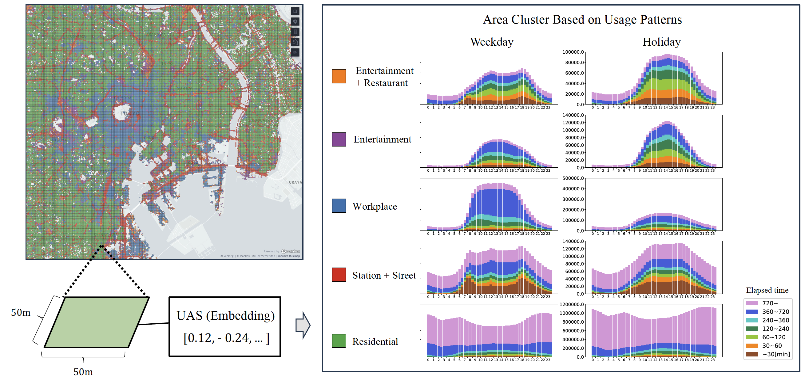

# OpenUAS

OpenUAS is a public dataset of area embeddings called UAS(Usage of Area with Stay information) which represents urban usage patterns. It captures the characteristics of each area in the city, such as office districts and residential areas, by employing an area embedding technique called Area2Vec that utilizes location information typically obtained by GPS. This dataset includes embeddings for over 1.3 million 50-meter square meshes covering a total area of 3,300 square kilometers, learned from over 175 million stay records extracted from GPS dataset in 8 major cities(Tokyo, Osaka, Nagoya, Sapporo, Fukuoka, Sendai, Hiroshima, Kyoto). It also allows users to embed their own location data using anchoring techniques and compare it with the functions of urban areas in Japan.

Users are permitted to use this dataset under the following conditions:

- Users must not attempt to identify individuals, cause damage to others or make any other malicious use of the data.
- The dataset is based on the Area2Vec technique, which is [patented](https://patentcenter.uspto.gov/applications/17205532). For commercial use, please contact us (open-uas@ucl.nuee.nagoya-u.ac.jp).

For more details, please refer to the following papers and github repository.

- Area2Vec: Shoji, K., Aoki, S., Yonezawa, T., & Kawaguchi, N. (2024). Area Modeling using Stay Information for Large-Scale Users and Analysis for Influence of COVID-19. https://arxiv.org/abs/2401.10648
- OpenUAS: Tamura, N., Shoji, K., Katayama, S., Urano, K., Yonezawa, T., & Kawaguchi, N. (2024). OpenUAS: Embeddings of Cities in Japan with Anchor Data for Cross-city Analysis of Area Usage Patterns. https://arxiv.org/abs/2407.19872
- OpenUAS repository: https://github.com/UCLabNU/OpenUAS/

Additionally, it would be helpful if you could provide any related data, papers, or other useful information.




## Getting Started

### 1. Create Environment

- Download this repository

  ```
  git clone https://github.com/UCLabNU/OpenUAS.git
  cd OpenUAS
  ```

- Set up an environment using Python 3.8.10.
  ```
  conda create -n "openuas" python=3.8.10
  conda activate openuas
  ```
- Install required libraries:
  ```
  pip install -r requirements.txt
  ```

### 2. Download data

- [Download OpenUAS](https://zenodo.org/records/13141800) -> ./data

<!-- <details>
  <summary><b>Dataset desctiption</b></summary> -->

- ./data/

  - japan_city/ : Area embedding data for 8 cities in Japan.

    - model/: .pth files of the trained Area2Vec for each dataset.
    - geojson/: GeoJSON files containing mesh data such as area embeddings and polygons for each dataset, which can be visualized using tools like kepler.gl.
      - `code`: Standard mesh code identifying specific geographical units.
      - `vector`: Embedding vector representing area usage patterns(UAS).
      - `5cluster`: Cluster number assigned when the UAS are clustered into 5 groups.
      - `10cluster`: Cluster number assigned when the UAS are clustered into 10 groups.
      - `20cluster`: Cluster number assigned when the UAS are clustered into 20 groups.
      - `mesh_size`: Indicates the size of the mesh, either 50m by 50m or 250m by 250m.
      - `is_complemented`: This flag is True for 50m mesh data that has been complemented with information from the enclosing 250m mesh due to insufficient data in the original 50m mesh.
    - `cluster_map/`: The visualization result of geojson using Kepler.gl(https://kepler.gl/) saved in HTML format.
      - `index.html`: An HTML that links to all dataset HTML files.
      - `html_files`: HTML files corresponding to each dataset.
    - `cluster_graph/`: Stacked graphs of stay for clustering into 5, 10, and 20 clusters. Each graph illustrates the stay trends within each cluster, with graphs on the left representing weekdays and graphs on the right representing holidays. The horizontal axis of each graph denotes the time of day, while the vertical axis shows the stay count at each time. The color coding in the graphs represents the duration of the stay.

  - `anchor_data/anchor_df.csv` : A dataset for anchoring purposes, sampled from a dataset in Japan with geographical information masked. It has almost the same columns as stay_df.csv, but for anonymity, stay_time and arrival_time are quantized in 15-minute intervals.

  - `sample_data/sample_df.csv`: Sample location data for training.

    - `day_of_week`, `is_holiday`, `arrival_time`: Specifies the day of the week, whether the date is a holiday, and the time of arrival at the specified location.
    - `mesh_id`: Identifier for the area.

  - `util_file/stay_weight_matrix.npy`: A weight matrix that assigns weights based on the duration of stay, used for the statistical analysis of stay features. For visualization and further details, refer to `clustering_and_visualization_of_embeddings.ipynb`.

<!-- </details> -->

## Using the OpenUAS

### 1. Visualize area usage patterns.

- `simple_visualization.ipynb`
  - Loading japan_city dataset.
  - Geofraphical mapping area embeddings using Kepler.gl.

### 2. Clustering area embeddings.

- `clustering_and_visualization_of_embeddings.ipynb`
  - Clustering of area embeddings.
  - Visualization of approximate statistics for each cluster.
  - Geofraphical mapping area embeddings using Kepler.gl.

### 3. Searching similar area using embeddings.

- `searching_similar_area.ipynb`
  - Mapping area embeddings using public data.
  - Searching for similar areas based on area embedding data.
  - Weighting areas based on similarity from a given area.
  - Geofraphical mapping area embeddings using Kepler.gl.

## Train your own

- `train_area2vec.py`
  - Code for training Area2Vec.
  - Allows embedding in the same latent space as public area embeddings using Anchoring.
  - Free learning without Anchoring is also possible.
  ```
  cd src
  python train_area2vec.py
  ```
